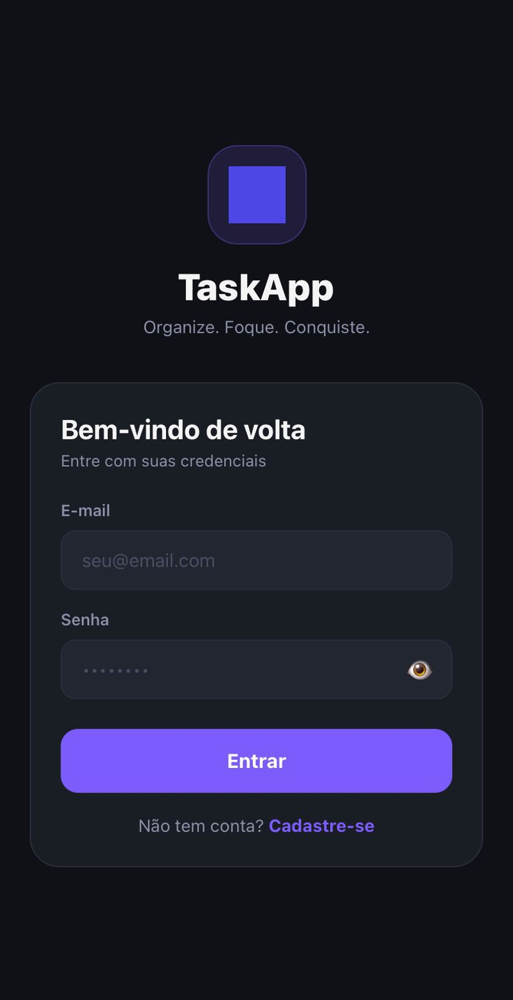
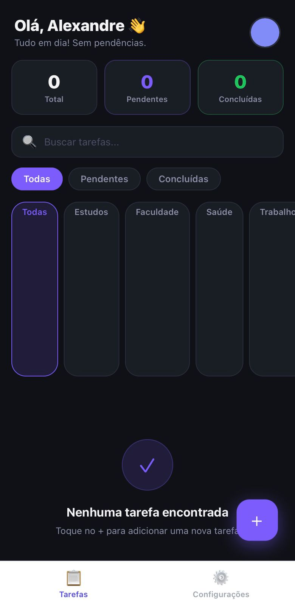
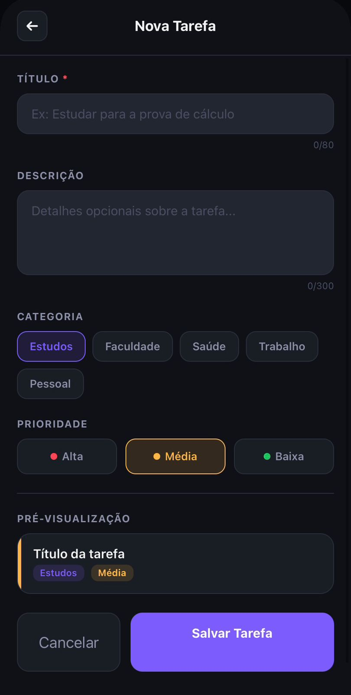
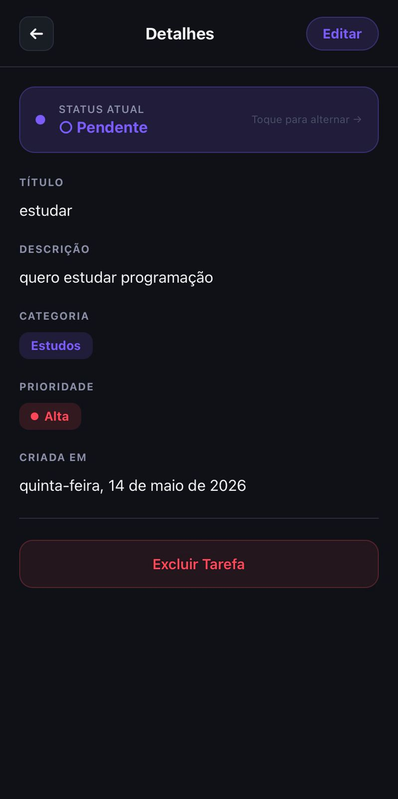
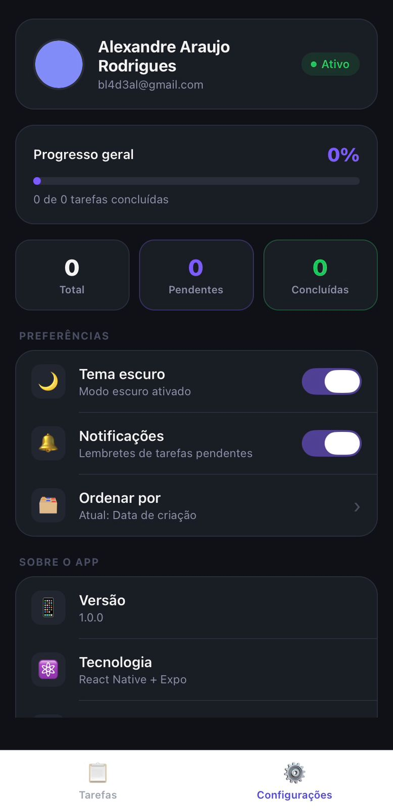
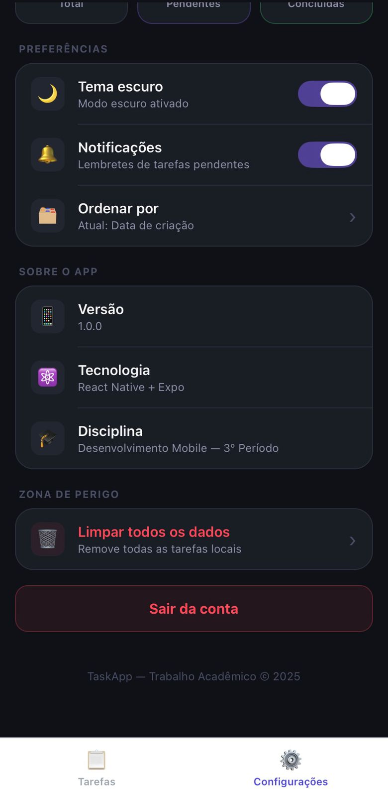

# 📋 TaskApp — Documentação Completa

> Trabalho Final — Desenvolvimento Mobile · 3º Período

🔗 **Repositório GitHub:** [https://github.com/crispim234/TaskApp2](https://github.com/crispim234/TaskApp2)

---

## 👥 Membros do Grupo

| Membro | Responsabilidade |
|--------|-----------------|
| Alexandre | Tela de Configurações, contexto global (`TaskContext`), integração Supabase |
| Fabrício | Tela Principal (`HomeScreen`), filtros e busca de tarefas |
| Marcus | Tela de Detalhes da Tarefa, edição e atualização de status |
| Patrick | Tela de Login/Cadastro, autenticação com Supabase, Tela de Splash |

---

## 1. Visão Geral do Projeto

### 1.1 Objetivo

O **TaskApp** é um aplicativo mobile de gerenciamento de tarefas desenvolvido em **React Native com Expo**. Seu objetivo é permitir que o usuário organize suas atividades do cotidiano de forma simples, intuitiva e eficiente, com suporte a categorias, prioridades, filtros, sincronização em nuvem e armazenamento local offline.

O projeto foi desenvolvido como trabalho acadêmico da disciplina de Desenvolvimento Mobile do 3º Período, com foco em boas práticas de desenvolvimento React Native, integração com backend como serviço (BaaS) via **Supabase**, e usabilidade mobile.

### 1.2 Problema que Resolve

Muitos estudantes e profissionais perdem prazos ou se confundem com múltiplas obrigações simultâneas. O TaskApp centraliza tarefas de diferentes áreas da vida (estudos, trabalho, saúde, etc.) em um só lugar, com visualização clara de prioridades e status, ajudando o usuário a manter o foco e a produtividade.

### 1.3 Público-Alvo

- Estudantes universitários que precisam gerenciar prazos acadêmicos
- Profissionais que desejam organizar tarefas pessoais e de trabalho
- Qualquer pessoa que queira uma ferramenta leve de to-do list com sincronização em nuvem

---

## 2. Funcionalidades Implementadas

| # | Funcionalidade | Descrição |
|---|----------------|-----------|
| 1 | 🔐 Autenticação | Login e cadastro com e-mail e senha via Supabase Auth |
| 2 | ✅ CRUD de Tarefas | Criar, visualizar, editar, concluir e excluir tarefas |
| 3 | 🏷️ Categorias | Classificação por: Estudos, Faculdade, Saúde, Trabalho, Pessoal |
| 4 | 🔥 Prioridades | Três níveis: Alta (vermelho), Média (amarelo), Baixa (verde) |
| 5 | 🔍 Busca e Filtros | Busca por título; filtro por status (Todas/Pendentes/Concluídas) e categoria |
| 6 | ⏱️ Auto-remoção | Tarefas concluídas são deletadas automaticamente após 10 segundos |
| 7 | ☁️ Sincronização | Dados persistidos em tempo real no Supabase (quando autenticado) |
| 8 | 📦 Modo Offline | Armazenamento local via `AsyncStorage` quando sem autenticação |
| 9 | 🌙 Tema | Alternância entre tema escuro e claro |
| 10 | 🔔 Notificações | Configuração de lembretes de tarefas pendentes (toggle nas configurações) |
| 11 | 📊 Progresso | Indicador visual de progresso geral das tarefas concluídas |
| 12 | 🗂️ Ordenação | Ordenar tarefas por data de criação ou prioridade |
| 13 | 👀 Pré-visualização | Preview em tempo real do card da tarefa ao criá-la |

---

## 3. Tecnologias Utilizadas

| Tecnologia | Versão | Função no Projeto |
|------------|--------|-------------------|
| React Native | 0.81.5 | Framework principal para desenvolvimento mobile multiplataforma |
| Expo | ~54.0 | Toolchain, build e acesso a APIs nativas |
| TypeScript | — | Tipagem estática, segurança e manutenibilidade do código |
| Supabase | ^2.105 | Backend como serviço: banco de dados PostgreSQL e autenticação |
| React Navigation | ^6.x | Navegação entre telas (Stack + Bottom Tabs) |
| AsyncStorage | 2.2.0 | Persistência local de dados e configurações |
| React Context API | — | Gerenciamento de estado global (tarefas, usuário, tema) |

---

## 4. Tipos de Usuários

O aplicativo possui **um único tipo de usuário**: o **Usuário Comum**, que pode:

- Criar conta e fazer login com e-mail e senha
- Criar, editar, concluir e excluir as próprias tarefas
- Personalizar preferências de tema, notificações e ordenação
- Operar no modo offline (sem login) com dados salvos localmente

> **Nota:** Não existe perfil de Administrador no escopo atual. Todos os usuários têm as mesmas permissões, cada um acessando exclusivamente seus próprios dados através do `user_id` no Supabase.

---

## 5. Telas do Aplicativo

### 5.1 Splash Screen

**Arquivo:** `src/screens/SplashScreen.tsx`

**Finalidade:** Tela de entrada do aplicativo exibida ao iniciá-lo. Apresenta a logo animada e o nome do app enquanto verifica se existe uma sessão de usuário ativa (via Supabase Auth). Caso haja sessão, redireciona automaticamente para a tela principal; caso contrário, direciona para o Login.

**Elementos visuais:**
- Logo do app centralizada
- Nome "TaskApp" com animação de entrada
- Fundo com as cores do tema configurado

**Navegação:**
- → `Login` (sem sessão ativa)
- → `Main` (com sessão ativa)

---

### 5.2 Login / Cadastro

**Arquivo:** `src/screens/LoginScreen.tsx`

**Finalidade:** Centraliza as operações de autenticação do usuário. A mesma tela alterna entre o modo **Login** e o modo **Cadastro**, evitando duplicação de telas.

**Campos no modo Login:**
- E-mail
- Senha (com toggle de visibilidade 👁/🙈)

**Campos adicionais no modo Cadastro:**
- Nome completo

**Validações:**
- E-mail e senha obrigatórios
- Senha com mínimo de 6 caracteres
- Nome obrigatório no cadastro

**Comportamento:**
- No login bem-sucedido: redireciona para `Main`
- No cadastro: exibe alerta para confirmar e-mail; retorna ao modo login

**Navegação:**
- → `Main` (após login bem-sucedido)

---

### 5.3 Home — Lista de Tarefas

**Arquivo:** `src/screens/HomeScreen.tsx`

**Finalidade:** Tela principal do aplicativo. Lista todas as tarefas do usuário com recursos avançados de busca e filtragem. É o hub central de interação com as tarefas.

**Elementos da tela:**
- **Cabeçalho:** saudação personalizada com o primeiro nome do usuário e avatar
- **Resumo:** três cards exibindo contagem de tarefas (Total, Pendentes, Concluídas)
- **Campo de busca:** filtra tarefas por título em tempo real (com botão de limpar)
- **Filtros de status:** chips horizontais — Todas / Pendentes / Concluídas
- **Filtros de categoria:** chips horizontais roláveis — Todas / Estudos / Faculdade / Saúde / Trabalho / Pessoal
- **Lista de tarefas:** cards com título, categoria, prioridade e status; toque marca/desmarca como concluída
- **Botão FAB (+):** abre a tela de Nova Tarefa via modal

**Comportamento:**
- Tarefas concluídas exibem feedback visual e são removidas após 10 segundos
- Tela vazia exibe ilustração com orientação para o usuário

**Navegação:**
- → `AddTask` (botão FAB)
- → `TaskDetail` (toque em um card de tarefa)
- → `Settings` (aba inferior)

---

### 5.4 Nova Tarefa

**Arquivo:** `src/screens/AddTaskScreen.tsx`

**Finalidade:** Formulário para criação de uma nova tarefa. Apresentado como modal sobre a tela principal, mantendo o contexto visual do usuário.

**Campos:**
- **Título** *(obrigatório)* — texto com limite de 80 caracteres e contador
- **Descrição** *(opcional)* — área de texto multilinha com limite de 300 caracteres
- **Categoria** — chips selecionáveis: Estudos, Faculdade, Saúde, Trabalho, Pessoal
- **Prioridade** — chips coloridos: Alta (🔴), Média (🟡), Baixa (🟢)

**Funcionalidade especial:**
- **Pré-visualização em tempo real:** card de preview que reflete as escolhas do usuário instantaneamente, mostrando exatamente como a tarefa aparecerá na lista

**Ações:**
- **Salvar Tarefa:** valida, persiste (Supabase ou AsyncStorage) e fecha o modal
- **Cancelar:** fecha o modal sem salvar

**Navegação:**
- ← Volta para `Home` (após salvar ou cancelar)

---

### 5.5 Detalhes da Tarefa

**Arquivo:** `src/screens/TaskDetailScreen.tsx`

**Finalidade:** Exibe todas as informações de uma tarefa específica e permite edição completa de seus campos. Acessível ao tocar em qualquer card na Home.

**Informações exibidas:**
- Título, descrição, categoria e prioridade
- Status atual (Pendente / Concluída)
- Data de criação

**Funcionalidades:**
- Edição inline de título, descrição, categoria e prioridade
- Alternância de status (Pendente ↔ Concluída)
- Exclusão da tarefa (com confirmação via Alert)
- Salvamento das alterações (sincronizado com Supabase ou AsyncStorage)

**Navegação:**
- ← Volta para `Home`

---

### 5.6 Configurações

**Arquivo:** `src/screens/SettingsScreen.tsx`

**Finalidade:** Centraliza informações do perfil, estatísticas do usuário e preferências do aplicativo.

**Seções:**

**Perfil:**
- Avatar do usuário
- Nome e e-mail
- Badge de status "Ativo"

**Progresso:**
- Barra de progresso visual indicando % de tarefas concluídas
- Contador "X de Y tarefas concluídas"

**Estatísticas:**
- Cards com contagem: Total, Pendentes, Concluídas

**Preferências:**
- 🌙 Tema: toggle escuro/claro
- 🔔 Notificações: ativar/desativar lembretes
- 🗂️ Ordenar por: alterna entre data de criação e prioridade

**Sobre o App:**
- Versão (1.0.0)
- Tecnologia utilizada
- Disciplina acadêmica

**Zona de Perigo:**
- Limpar todos os dados locais (com confirmação)
- Botão de logout (com confirmação)

**Navegação:**
- → `Login` (após logout)

---

## 6. Fluxo de Navegação

```
┌─────────────┐
│ Splash      │
│ (entrada)   │
└──────┬──────┘
       │ sessão ativa?
   Não │              Sim
       ▼              ▼
┌─────────────┐   ┌──────────────────────────────────┐
│   Login /   │──►│  MAIN (Bottom Tab Navigator)     │
│  Cadastro   │   │  ┌────────────┐ ┌──────────────┐ │
└─────────────┘   │  │    Home    │ │ Configurações│ │
                  │  │  (Tarefas) │ │              │ │
                  │  └─────┬──────┘ └──────────────┘ │
                  └────────┼─────────────────────────┘
                           │
              ┌────────────┴───────────────┐
              ▼                            ▼
   ┌─────────────────────┐    ┌────────────────────────┐
   │  Nova Tarefa (Modal)│    │   Detalhes da Tarefa   │
   │  (AddTaskScreen)    │    │   (TaskDetailScreen)   │
   └─────────────────────┘    └────────────────────────┘
```

**Stack Navigator (pilha):** Splash → Login → Main → AddTask / TaskDetail

**Bottom Tab Navigator (abas):** Home (Tarefas) ↔ Configurações

---

## 7. Banco de Dados

### 7.1 Tabela `users` (gerenciada pelo Supabase Auth)

O Supabase Auth gerencia automaticamente os dados de autenticação dos usuários.

| Coluna | Tipo | Descrição |
|--------|------|-----------|
| `id` | uuid | Chave primária gerada automaticamente |
| `email` | text | E-mail do usuário (único) |
| `user_metadata.name` | jsonb | Nome completo informado no cadastro |
| `created_at` | timestamptz | Data de criação da conta |

### 7.2 Tabela `tasks`

| Coluna | Tipo | Restrição | Descrição |
|--------|------|-----------|-----------|
| `id` | uuid | PRIMARY KEY | Identificador único da tarefa |
| `user_id` | uuid | FOREIGN KEY → auth.users | Dono da tarefa |
| `title` | text | NOT NULL | Título da tarefa (máx. 80 caracteres) |
| `description` | text | NULLABLE | Descrição opcional (máx. 300 caracteres) |
| `category` | text | NOT NULL | Estudos / Faculdade / Saúde / Trabalho / Pessoal |
| `priority` | text | NOT NULL | Alta / Média / Baixa |
| `status` | text | NOT NULL, DEFAULT 'pendente' | pendente / concluído |
| `created_at` | timestamptz | DEFAULT now() | Data e hora de criação |

### 7.3 Relacionamentos

```
auth.users (1) ──────────────── (N) tasks
    id                              user_id (FK)
```

### 7.4 Políticas de Segurança (Row Level Security)

O Supabase utiliza RLS para garantir que cada usuário acesse somente suas próprias tarefas:

```sql
-- Usuário só pode ver suas próprias tarefas
CREATE POLICY "Usuário vê apenas suas tarefas"
ON tasks FOR SELECT
USING (auth.uid() = user_id);

-- Usuário só pode criar tarefas para si mesmo
CREATE POLICY "Usuário cria apenas suas tarefas"
ON tasks FOR INSERT
WITH CHECK (auth.uid() = user_id);

-- Usuário só pode atualizar suas próprias tarefas
CREATE POLICY "Usuário atualiza apenas suas tarefas"
ON tasks FOR UPDATE
USING (auth.uid() = user_id);

-- Usuário só pode excluir suas próprias tarefas
CREATE POLICY "Usuário exclui apenas suas tarefas"
ON tasks FOR DELETE
USING (auth.uid() = user_id);
```

---

## 8. Proposta de Backend (API REST)

Embora o projeto utilize o Supabase como BaaS (que já fornece endpoints REST automaticamente), segue abaixo a proposta de uma API REST própria, caso o projeto evoluísse para um backend Node.js/Express dedicado.

### 8.1 Autenticação

| Método | Rota | Descrição |
|--------|------|-----------|
| `POST` | `/api/auth/register` | Cadastrar novo usuário |
| `POST` | `/api/auth/login` | Autenticar usuário (retorna JWT) |
| `POST` | `/api/auth/logout` | Invalidar sessão do usuário |
| `GET` | `/api/auth/me` | Retornar dados do usuário autenticado |

**Exemplo de corpo — POST /api/auth/register:**
```json
{
  "name": "João Silva",
  "email": "joao@email.com",
  "password": "minhasenha123"
}
```

**Exemplo de resposta — POST /api/auth/login:**
```json
{
  "token": "eyJhbGciOiJIUzI1NiIsInR5cCI6IkpXVCJ9...",
  "user": {
    "id": "uuid-do-usuario",
    "name": "João Silva",
    "email": "joao@email.com"
  }
}
```

### 8.2 Tarefas

Todas as rotas abaixo requerem autenticação via Bearer Token no header `Authorization`.

| Método | Rota | Descrição |
|--------|------|-----------|
| `GET` | `/api/tasks` | Listar todas as tarefas do usuário autenticado |
| `GET` | `/api/tasks/:id` | Buscar uma tarefa específica |
| `POST` | `/api/tasks` | Criar nova tarefa |
| `PUT` | `/api/tasks/:id` | Atualizar todos os campos de uma tarefa |
| `PATCH` | `/api/tasks/:id/status` | Alterar somente o status (pendente/concluído) |
| `DELETE` | `/api/tasks/:id` | Excluir uma tarefa |

**Query Params — GET /api/tasks:**

| Param | Tipo | Exemplo | Descrição |
|-------|------|---------|-----------|
| `status` | string | `pendente` | Filtrar por status |
| `category` | string | `Estudos` | Filtrar por categoria |
| `search` | string | `prova` | Buscar por título |
| `sortBy` | string | `data` ou `prioridade` | Ordenação |

**Exemplo de corpo — POST /api/tasks:**
```json
{
  "title": "Estudar para a prova de cálculo",
  "description": "Revisar integrais e derivadas.",
  "category": "Estudos",
  "priority": "Alta"
}
```

---

## 9. Estrutura do Projeto

```
TaskApp2/
├── App.tsx                         # Configuração de navegação (Stack + Bottom Tabs)
├── app.json                        # Configuração do Expo
├── tsconfig.json                   # Configuração TypeScript
├── package.json                    # Dependências do projeto
├── babel.config.js                 # Configuração do Babel/Expo
│
├── assets/                         # Recursos estáticos
│   ├── icon.png                    # Ícone do app
│   ├── splash.png                  # Imagem de splash
│   ├── logo.png                    # Logo usada na tela de Login
│   ├── avatar.png                  # Avatar padrão dos usuários
│   └── screenshots/                # Prints das telas para documentação
│
└── src/
    ├── config/
    │   └── supabase.ts             # Inicialização do cliente Supabase
    │
    ├── context/
    │   └── TaskContext.tsx         # Estado global: tarefas, usuário, tema, CRUD
    │
    ├── components/
    │   └── TaskItem.tsx            # Componente de card de tarefa reutilizável
    │
    ├── screens/
    │   ├── SplashScreen.tsx        # Tela de entrada com animação
    │   ├── LoginScreen.tsx         # Login e cadastro
    │   ├── HomeScreen.tsx          # Lista de tarefas com filtros
    │   ├── AddTaskScreen.tsx       # Formulário de nova tarefa (modal)
    │   ├── TaskDetailScreen.tsx    # Detalhes e edição de tarefa
    │   └── SettingsScreen.tsx      # Configurações e perfil
    │
    ├── theme/
    │   └── colors.ts               # Paleta de cores (tema claro e escuro)
    │
    └── types/
        └── index.ts                # Tipos TypeScript: Task, Settings, Navigation
```

---

## 10. Prints das Telas

### Tela de Login

> Tela de autenticação com campos de e-mail e senha, botão de entrar e link para cadastro. Logo do app com slogan "Organize. Foque. Conquiste."



---

### Tela Principal — Home (Lista de Tarefas)

> Exibe saudação personalizada, resumo de tarefas (Total / Pendentes / Concluídas), campo de busca, filtros de status e categoria, lista de tarefas e botão FAB (+) para adicionar nova tarefa.



---

### Tela Nova Tarefa

> Formulário modal para criação de tarefa: campos de Título (obrigatório, máx. 80 chars) e Descrição (opcional, máx. 300 chars), seleção de Categoria e Prioridade, e pré-visualização em tempo real do card antes de salvar.



---

### Tela de Detalhes da Tarefa

> Exibe todas as informações da tarefa selecionada: status atual (com botão para alternar), título, descrição, categoria, prioridade e data de criação. Possui botões de Editar (canto superior direito) e Excluir Tarefa.



---

### Tela de Configurações — Parte 1 (Perfil e Progresso)

> Seção superior com: card de perfil do usuário (nome, e-mail, badge "Ativo"), barra de progresso geral e cards de estatísticas. Logo abaixo, seção de Preferências com toggles de tema, notificações e ordenação.



---

### Tela de Configurações — Parte 2 (Sobre o App e Zona de Perigo)

> Seção "Sobre o App" com versão, tecnologia e disciplina. Seção "Zona de Perigo" com opção de limpar dados locais. Botão de "Sair da conta" em destaque vermelho ao final da tela.



---

## 11. Planejamento de Expansão — Novas Funcionalidades

### 11.1 🗓️ Data e Hora de Vencimento (Due Date)

**Descrição:** Adicionar um campo de data/hora limite para cada tarefa. O app exibiria alertas de aproximação do prazo e marcaria visualmente tarefas atrasadas em vermelho.

**Utilidade:** Essencial para o controle de prazos acadêmicos e profissionais. Seria integrado ao sistema de notificações push para lembrar o usuário antes do vencimento.

**Implementação:** Novo campo `due_date` (timestamptz) na tabela `tasks`; uso de `expo-notifications` para agendar lembretes locais.

---

### 11.2 📁 Projetos / Listas Agrupadas

**Descrição:** Permitir que o usuário crie "projetos" ou "listas personalizadas" para agrupar tarefas relacionadas (ex: "TCC", "Trabalho Freelance", "Reforma da Casa").

**Utilidade:** Aumenta a organização para usuários com muitas tarefas, permitindo visualizar o progresso de um projeto inteiro de forma isolada.

**Implementação:** Nova tabela `projects` com relação 1:N com `tasks`; nova tela de gerenciamento de projetos.

---

### 11.3 🔁 Tarefas Recorrentes

**Descrição:** Opção de criar tarefas que se repetem automaticamente (diariamente, semanalmente, mensalmente). Ao concluir uma tarefa recorrente, a próxima ocorrência é criada automaticamente.

**Utilidade:** Ideal para hábitos e rotinas (ex: "Fazer exercícios — toda segunda-feira", "Pagar conta de água — todo dia 10").

**Implementação:** Campo `recurrence` na tabela `tasks` (ex: `daily`, `weekly`, `monthly`) + lógica de criação automática da próxima instância na função `toggleStatus`.

---

### 11.4 🏷️ Tags Personalizadas

**Descrição:** Além das categorias fixas atuais, permitir que o usuário crie suas próprias tags/etiquetas coloridas para classificar tarefas de forma livre (ex: "urgente", "aguardando resposta", "importante").

**Utilidade:** Flexibilidade para usuários com necessidades específicas que vão além das categorias padrão.

**Implementação:** Nova tabela `tags` e tabela de junção `task_tags` (N:M); interface de criação e gerenciamento de tags nas Configurações.

---

### 11.5 📊 Relatórios e Histórico

**Descrição:** Tela de relatórios com gráficos mostrando: tarefas concluídas por semana/mês, distribuição por categoria, evolução da produtividade ao longo do tempo.

**Utilidade:** Ajuda o usuário a entender seus padrões de produtividade e identificar áreas em que está atrasando mais.

**Implementação:** Biblioteca de gráficos como `react-native-chart-kit`; consultas agregadas no Supabase; nova aba na navegação inferior.

---

### 11.6 🤝 Compartilhamento de Tarefas / Colaboração

**Descrição:** Permitir que o usuário compartilhe uma tarefa ou projeto com outro usuário do app, com permissões de visualização ou edição.

**Utilidade:** Útil para trabalhos em grupo, tarefas familiares compartilhadas ou delegação de responsabilidades em equipes pequenas.

**Implementação:** Tabela `task_collaborators` (task_id, user_id, role); notificação push ao ser adicionado como colaborador.

---

### 11.7 🔒 Autenticação Social (OAuth)

**Descrição:** Adicionar opções de login via Google e Apple, além do e-mail/senha atual. O Supabase suporta nativamente esses providers.

**Utilidade:** Reduz a fricção de cadastro, aumentando a adoção do app por novos usuários.

**Implementação:** Configuração dos providers OAuth no painel do Supabase; uso de `expo-auth-session` no cliente mobile.

---

### 11.8 🎨 Temas Personalizados e Acessibilidade

**Descrição:** Além do modo claro/escuro, oferecer paletas de cores alternativas (ex: tema roxo, azul, verde) e opções de acessibilidade como aumento de fonte e modo de alto contraste.

**Utilidade:** Melhora a experiência para usuários com deficiências visuais e permite personalização estética.

**Implementação:** Expansão do objeto `ThemeColors` com múltiplas paletas; opção de seleção nas Configurações.

---

## 12. Como Executar o Projeto

### Pré-requisitos

- Node.js 18 ou superior
- Expo Go instalado no celular (iOS ou Android)
- Conta no [Supabase](https://supabase.com/)

### Passo a Passo

**1. Clone o repositório**
```bash
git clone https://github.com/crispim234/TaskApp2.git
cd TaskApp2
```

**2. Instale as dependências**
```bash
npm install
```

**3. Configure as variáveis de ambiente**

Crie um arquivo `.env` na raiz:
```env
EXPO_PUBLIC_SUPABASE_URL=https://seu-projeto.supabase.co
EXPO_PUBLIC_SUPABASE_ANON_KEY=sua-chave-anon
```

**4. Crie a tabela no Supabase**

Execute no SQL Editor do Supabase:
```sql
CREATE TABLE tasks (
  id uuid PRIMARY KEY DEFAULT gen_random_uuid(),
  user_id uuid REFERENCES auth.users(id) ON DELETE CASCADE NOT NULL,
  title text NOT NULL,
  description text,
  category text NOT NULL,
  priority text NOT NULL CHECK (priority IN ('Alta', 'Média', 'Baixa')),
  status text NOT NULL DEFAULT 'pendente' CHECK (status IN ('pendente', 'concluído')),
  created_at timestamptz DEFAULT now() NOT NULL
);

ALTER TABLE tasks ENABLE ROW LEVEL SECURITY;

CREATE POLICY "tasks_select" ON tasks FOR SELECT USING (auth.uid() = user_id);
CREATE POLICY "tasks_insert" ON tasks FOR INSERT WITH CHECK (auth.uid() = user_id);
CREATE POLICY "tasks_update" ON tasks FOR UPDATE USING (auth.uid() = user_id);
CREATE POLICY "tasks_delete" ON tasks FOR DELETE USING (auth.uid() = user_id);
```

**5. Inicie o app**
```bash
npm start
```

Escaneie o QR code com o Expo Go ou rode em emulador:
```bash
npm run android   # Android
npm run ios       # iOS
```

---

## 13. Ferramentas de Apoio Utilizadas / Recomendadas

| Ferramenta | Uso |
|------------|-----|
| [Figma](https://www.figma.com) | Design de telas e protótipos de UI |
| [dbdiagram.io](https://dbdiagram.io) | Modelagem e visualização do banco de dados |
| [Draw.io](https://app.diagrams.net) | Diagramas de fluxo e arquitetura |
| [Supabase Studio](https://app.supabase.com) | Administração do banco de dados |
| [Expo Dev Tools](https://expo.dev) | Build, preview e distribuição do app |

---

## 14. Diagrama do Banco de Dados (dbdiagram.io)

Código para importar no [dbdiagram.io](https://dbdiagram.io):

```
Table users {
  id uuid [pk, note: "Gerenciado pelo Supabase Auth"]
  email text [unique, not null]
  name text [note: "user_metadata.name"]
  created_at timestamptz [default: "now()"]
}

Table tasks {
  id uuid [pk, default: "gen_random_uuid()"]
  user_id uuid [not null, ref: > users.id]
  title text [not null, note: "máx. 80 caracteres"]
  description text [note: "opcional, máx. 300 caracteres"]
  category text [not null, note: "Estudos | Faculdade | Saúde | Trabalho | Pessoal"]
  priority text [not null, note: "Alta | Média | Baixa"]
  status text [not null, default: "pendente", note: "pendente | concluído"]
  created_at timestamptz [not null, default: "now()"]
}
```

---

## 15. Link do Repositório

| | |
|--|--|
| 🔗 **GitHub** | [https://github.com/crispim234/TaskApp2](https://github.com/crispim234/TaskApp2) |
| 📌 **Clone** | `git clone https://github.com/crispim234/TaskApp2.git` |

---

*TaskApp — Trabalho Acadêmico · Desenvolvimento Mobile · 3º Período · 2025*
